# 🎬 ShowBuzz – Online Movie Ticket Booking System
### _Book Movies • Choose Seats • Instant Ticketing_

<p align="center">
  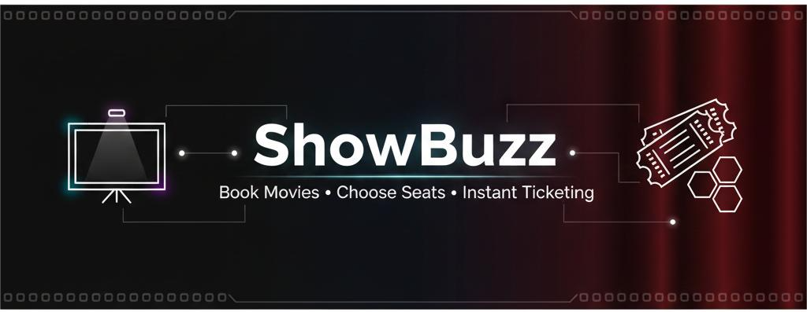
</p>
<p align="center">
  
  
  
  
  
</p>

<p align="center">
  🎟️ A fast, user-friendly web platform for seamless movie ticket booking
</p>

---

## 📌 Table of Contents
- [📖 About the Project](#-about-the-project)
- [🎯 Objectives](#-objectives)
- [✨ Key Features](#-key-features)
- [🧩 System Architecture](#-system-architecture)
- [🧭 User Booking Flow](#-user-booking-flow)
- [🎥 Demo & Screenshots](#-demo--screenshots)
- [🛠️ Tech Stack](#-tech-stack)
- [📂 Project Structure](#-project-structure)
- [🗄️ Database Design Overview](#-database-design-overview)
- [⚙️ Setup & Installation](#-setup--installation)
- [🚀 Usage Guide](#-usage-guide)
- [🧪 Sample Test Scenario](#-sample-test-scenario)
- [🔌 API Endpoints](#-api-endpoints)
- [🔐 Security Considerations](#-security-considerations)
- [🚧 Challenges & Learnings](#-challenges--learnings)
- [🔮 Future Enhancements](#-future-enhancements)
- [🤝 Contributing](#-contributing)
- [📜 License](#-license)
- [👩‍💻 Author](#-author)

---

## 📖 About the Project

**ShowBuzz** is a web-based movie ticket booking system that allows users to browse movies, select theaters and showtimes, choose seats interactively, and book tickets online.

The platform includes a role-based admin panel to manage movies, theaters, schedules, and bookings efficiently.

This project was developed as an academic full-stack web application inspired by real-world platforms like BookMyShow, focusing on frontend development, backend APIs, and database management.

---

## 🎯 Objectives

- Build a realistic online movie ticket booking platform
- Implement user and admin role-based access
- Design an interactive seat selection system
- Practice frontend–backend integration
- Understand database-driven web applications

---

## ✨ Key Features

### 👤 User Features
- Secure login and logout
- Browse movies with details
- View theaters and showtimes
- Interactive seat selection
- Ticket booking and confirmation
- View booking history

### 🛠️ Admin Features
- Add / Edit / Delete movies
- Manage theaters and showtimes
- View and manage all bookings
- Basic user management

---

## 🧩 System Architecture

<p align="center">
  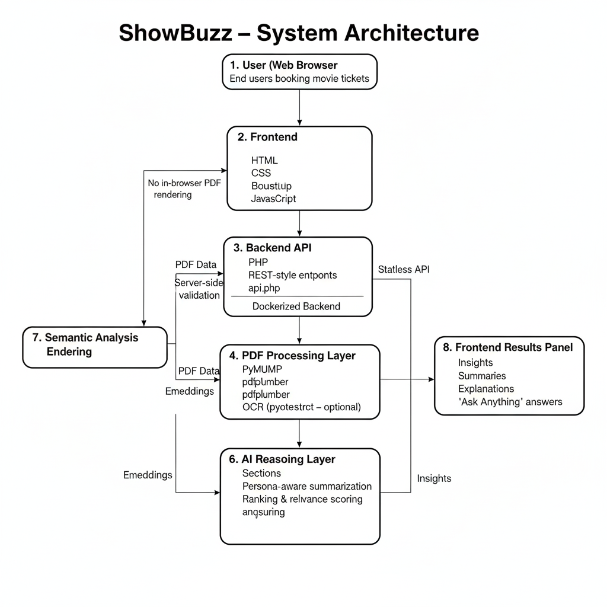
</p>

<p align="center"><i>High-level architecture: Users → Frontend → PHP Backend API → MySQL Database</i></p>

**Flow Overview**
- User → Frontend (HTML/CSS/JS)
- Frontend → PHP Backend API
- Backend → MySQL Database

## 🧭 User Booking Flow

1. User logs into the system
2. Browses available movies
3. Selects a movie and preferred showtime
4. Chooses theater and seat(s)
5. Confirms ticket quantity
6. Booking details are stored in the database
7. User receives booking confirmation

<p align="center"><i>This flow mimics real-world movie ticket booking platforms</i></p>

---
## 🧭 User Booking Flow Diagram  
**Visual walkthrough of the end-to-end ticket booking process**

<p align="center">
  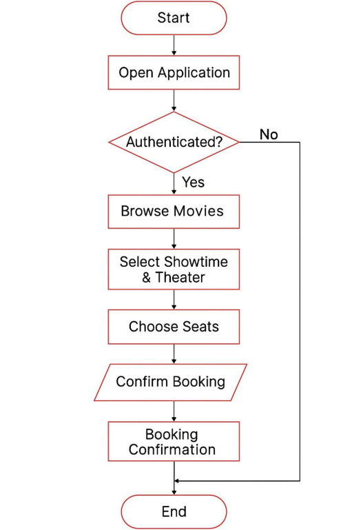
</p>

<p align="center">
  <i>
    This flowchart illustrates the complete user journey in ShowBuzz — 
    from opening the application and authentication to seat selection 
    and final booking confirmation.
  </i>
</p>

### 🔍 Flow Explanation
1. User opens the application
2. System checks authentication status  
   - If not authenticated → redirect to login
3. Authenticated user browses available movies
4. User selects a movie, theater, and showtime
5. Seats are chosen from the interactive layout
6. Booking is confirmed
7. System displays booking confirmation and ends the flow
---

## 🎥 Demo & Screenshots  
_A complete walkthrough of the ShowBuzz user and admin experience_

---

### 🔐 Login & Authentication  
**Secure access for users and administrators**

<p align="center">
  
</p>
<p align="center"><i>Users and admins log in through a clean, role-based authentication interface</i></p>

---

### 🏠 Home Page – Movie Discovery  
**Browse trending and recommended movies at a glance**

<p align="center">
  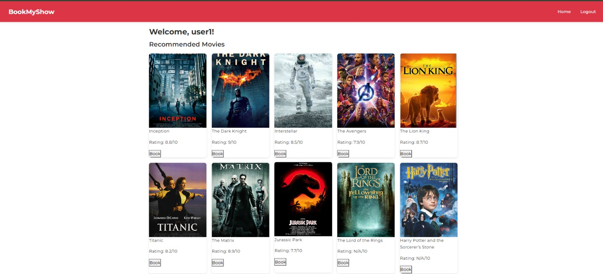
</p>
<p align="center"><i>Displays popular movies with posters, ratings, and booking options</i></p>

---

### 🎬 Movie Details Page  
**Explore movie information before booking**

<p align="center">
  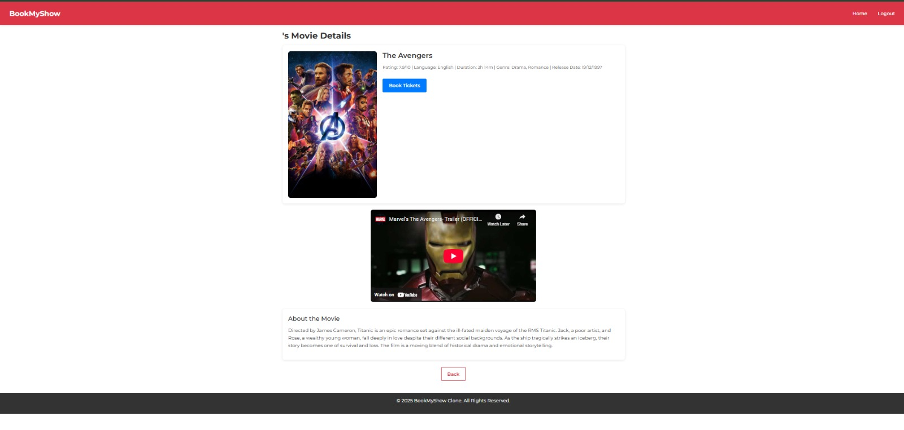
</p>
<p align="center"><i>Detailed view including movie description, ratings, language, duration, and trailer</i></p>

---

### 🏢 Theater & Showtime Selection  
**Choose your preferred theater and showtime**

<p align="center">
  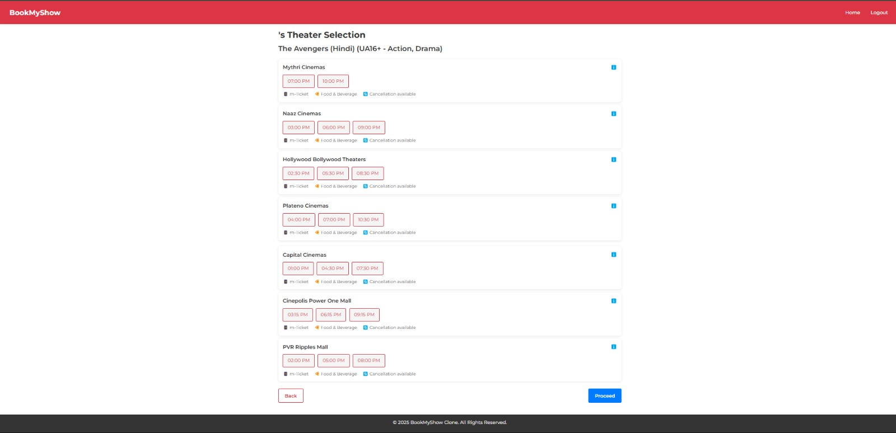
</p>
<p align="center"><i>Lists available theaters with multiple show timings for the selected movie</i></p>

---

### 🎟️ Ticket Quantity Selection  
**Select how many seats you want to book**

<p align="center">
  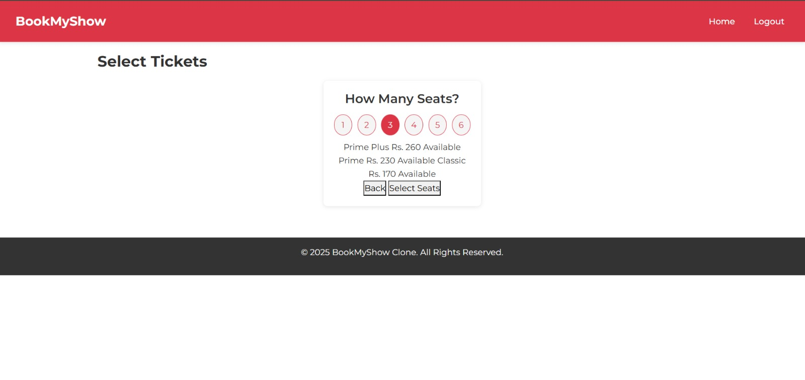
</p>
<p align="center"><i>Simple interface to choose ticket count and seating category</i></p>

---

### 💺 Seat Selection Interface  
**Interactive real-time seat booking**

<p align="center">
  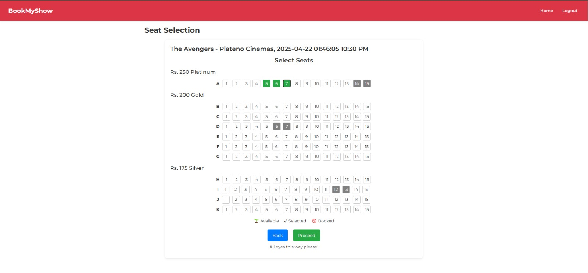
</p>
<p align="center"><i>Visual seat layout showing available, selected, and booked seats</i></p>

---

### ✅ Booking Confirmation  
**Review and confirm your ticket details**

<p align="center">
  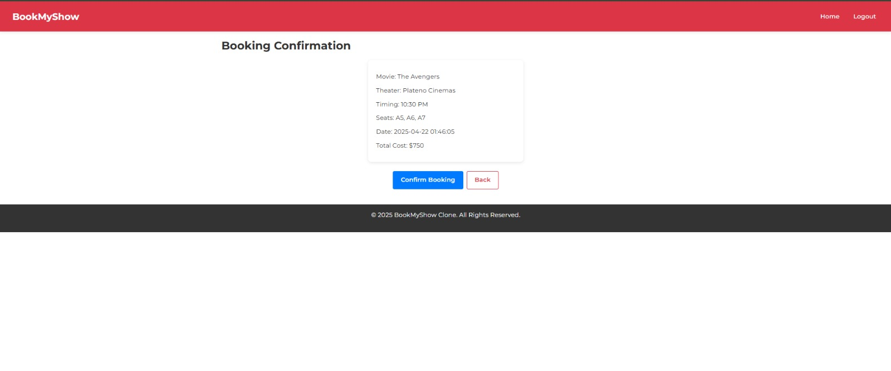
</p>
<p align="center"><i>Final booking summary with movie, theater, seats, timing, and total cost</i></p>

---

### 🛠️ Admin Dashboard – Movie Management  
**Add, edit, and manage movies**

<p align="center">
  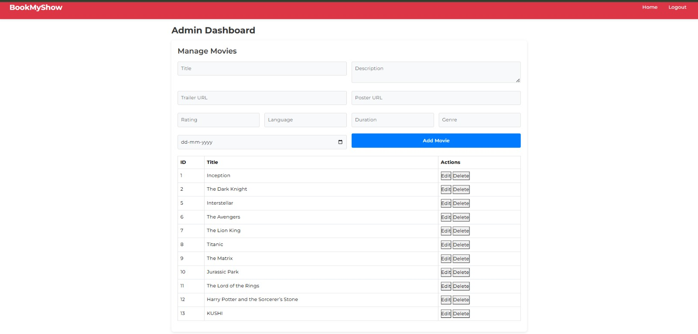
</p>
<p align="center"><i>Admin interface to manage movie listings and metadata</i></p>

---

### 🏢 Admin Dashboard – Theater Management  
**Control theater listings**

<p align="center">
  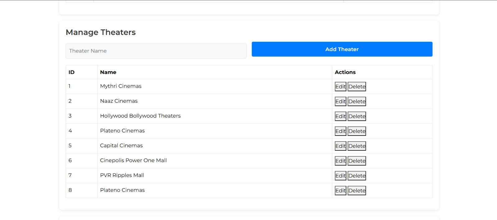
</p>
<p align="center"><i>Admins can add, edit, or remove theaters from the system</i></p>

---

### 📊 Admin Dashboard – Booking Overview  
**Monitor all user bookings**

<p align="center">
  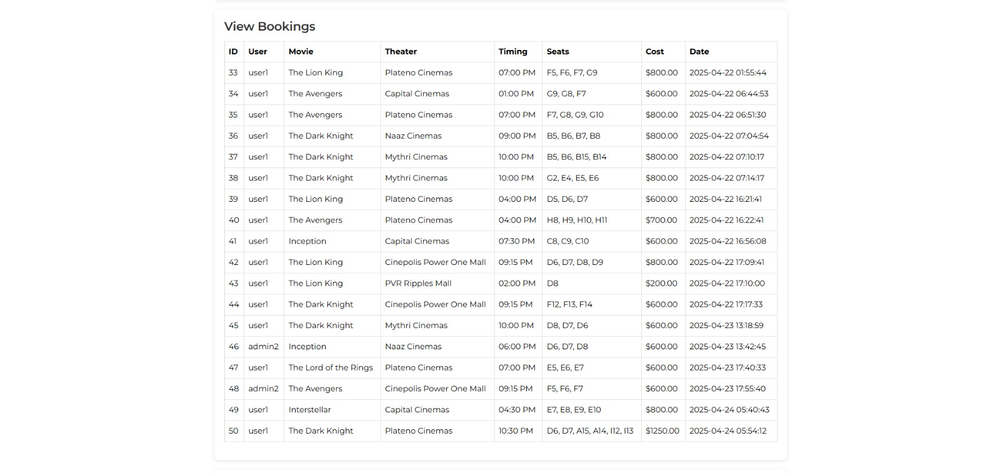
</p>
<p align="center"><i>Complete booking history with user, movie, theater, seats, and payment details</i></p>

---

<p align="right">
  (<a href="#-showbuzz-%E2%80%93-online-movie-ticket-booking-system">⬆ Back to top</a>)
</p>

---

## 🛠️ Tech Stack

### Frontend
- HTML5
- CSS3
- Bootstrap 5.3.3
- JavaScript (ES6)
- LocalStorage

### Backend
- PHP 7.4+
- MySQL
- REST-style API architecture

### Tools
- XAMPP / WAMP
- VS Code

---

## 📂 Project Structure

```text
Movie_tickets_booking/
├── backend/
│   └── api.php                  # Backend API & DB operations
├── admin.html                   # Admin dashboard
├── login.html                   # User authentication
├── home.html                    # Movie listing
├── movie_details.html           # Movie details & showtimes
├── theater_selection.html       # Theater & showtime selection
├── seat_selection.html          # Seat booking UI
├── ticket_selection.html        # Ticket quantity selection
├── confirmation.html            # Booking confirmation
├── script.js                    # Main JavaScript logic
├── styles.css                   # Custom styles
├── assets/
│   ├── banner/
│   ├── architecture/
│   └── screenshots/
└── README.md                    # Original README (kept unchanged)
```

---

## 🗄️ Database Design Overview

The system uses a relational MySQL database with the following core tables:

- **users** – stores user credentials and roles
- **movies** – movie details such as title, genre, duration
- **theaters** – available theaters and locations
- **showtimes** – movie schedules
- **seats** – seat availability tracking
- **bookings** – user booking records

The schema is designed to maintain data integrity and support efficient booking operations.

---

## ⚙️ Setup & Installation

### Prerequisites
- XAMPP / WAMP / MAMP
- PHP 7.4+
- MySQL
- Modern web browser

### Installation Steps

1. **Clone the repository**
   ```bash
   git clone <repository-url>
   cd Movie_tickets_booking
   ```

2. **Create the database**
   - Open phpMyAdmin (http://localhost/phpmyadmin)
   - Create a database named `bookmyshow`
   - Import the provided SQL file (if included with the project)

3. **Configure backend database connection**
   - Open `backend/api.php` and update the DB credentials:
   ```php
   $conn = new mysqli("localhost", "username", "password", "bookmyshow");
   if ($conn->connect_error) {
       die("Connection failed: " . $conn->connect_error);
   }
   ```

4. **Run the project locally**
   - Place the project folder inside `htdocs` (XAMPP) or `www` (WAMP)
   - Start Apache and MySQL from your stack manager
   - Open in browser:
   ```bash
   http://localhost/Movie_tickets_booking/login.html
   ```

---

## 🚀 Usage Guide
- Login as user or admin
- Browse available movies
- Select theater, showtime, and seats
- Confirm booking
- View booking confirmation

### 🔑 Default Admin Credentials
```
Username: admin
Password: admin
```

---

## 🧪 Sample Test Scenario

**Scenario:** Booking 2 tickets for an evening show

- Movie: Inception
- Theater: PVR Cinemas
- Showtime: 7:30 PM
- Seats Selected: B5, B6
- User: Registered user
- Result: Booking successfully stored and confirmation displayed

This scenario was used to validate end-to-end functionality.

---

## 🔌 API Endpoints

| Method | Endpoint                      | Description                 |
|-------:|-------------------------------|-----------------------------|
| POST   | `backend/api.php?action=login`    | User authentication         |
| GET    | `backend/api.php?action=movies`   | Fetch movies                |
| POST   | `backend/api.php?action=book`     | Book tickets                |
| GET    | `backend/api.php?action=bookings` | View bookings (admin)       |
| POST   | `backend/api.php?action=add_movie`| Add movie (admin)           |

> Note: Adjust the base path if your server root is different.

---

## 🔐 Security Considerations

- Role-based access control for admin features
- Client-side validations for form inputs
- Backend validation before database operations
- Admin actions restricted via API checks
- Database credentials stored only on server-side

> Note: Password hashing and advanced security can be added in future iterations.

---

## 🚧 Challenges & Learnings
- Implementing interactive seat selection
- Frontend–backend communication using APIs
- Handling role-based access (admin vs user)
- Database design for bookings and seats

---

## 🔮 Future Enhancements
- Online payment gateway integration
- Email/SMS ticket confirmation
- Password hashing and enhanced security
- Search and filter by genre or language
- Booking cancellation and refund system
- Mobile application version

---

## 🤝 Contributing
- Fork the repository
- Create a feature branch
- Commit your changes
- Open a Pull Request

---

## 📜 License
This project is licensed under the **MIT License**.

---

## 👩‍💻 Author
**Gudiwada Sruthi**  
B.Tech – Computer Science & Engineering  
SRM University, AP

<p align="right">(<a href="#-showbuzz-%E2%80%93-online-movie-ticket-booking-system">⬆ Back to top</a>)</p>
